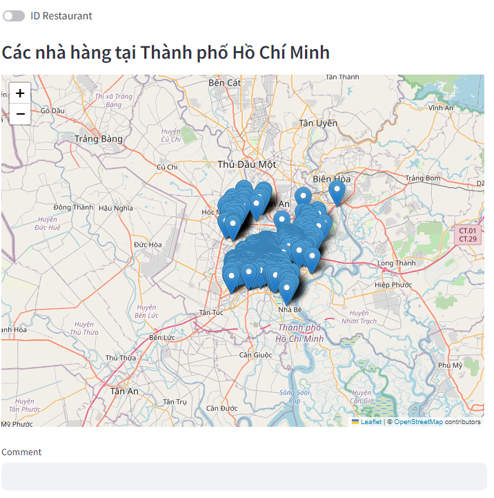
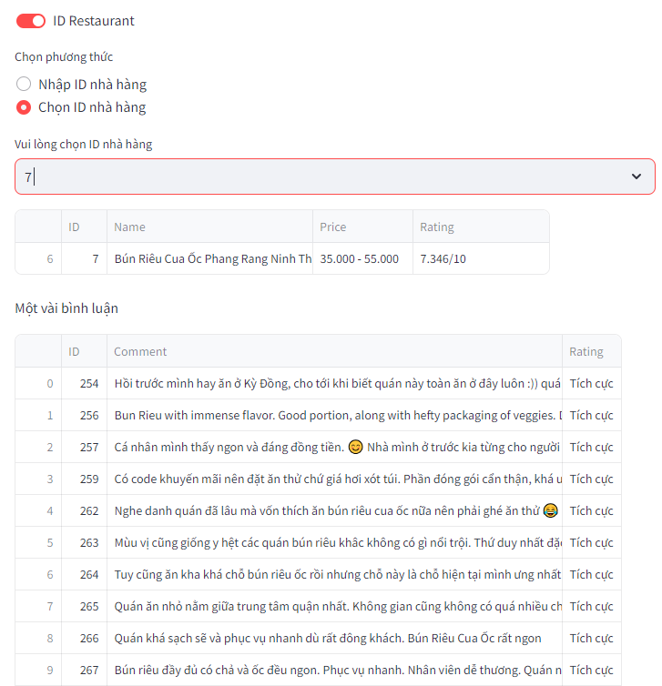
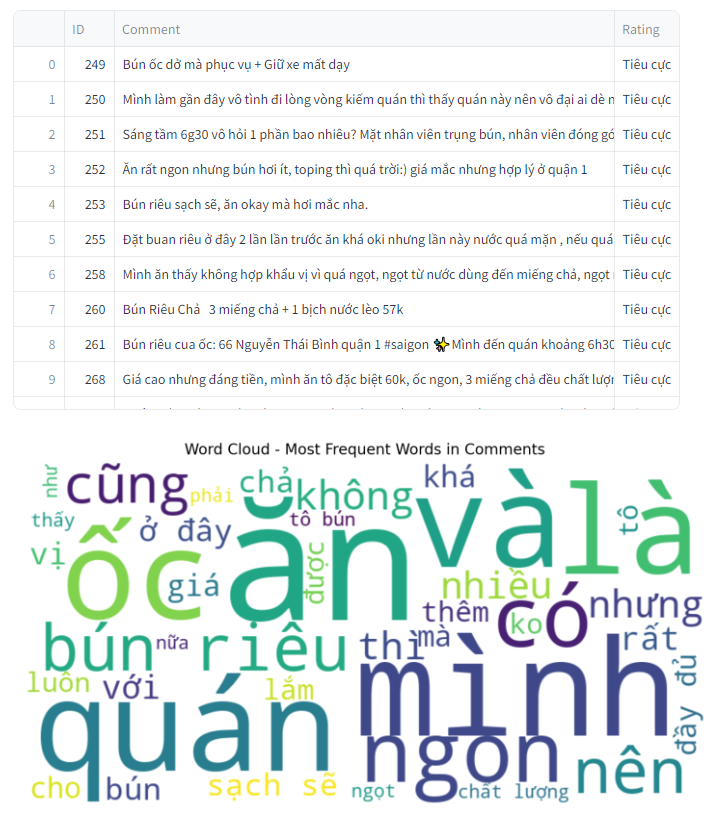
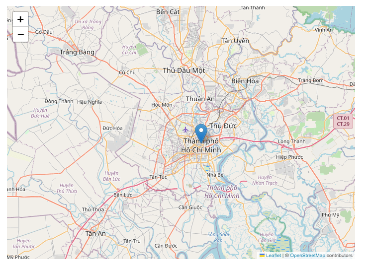

#### Data Science Project

**Users have 2 options:**
- The user enters a comment and it predicts whether the comment is positive or negative

- If the user selects the restaurant ID, it will display information about this restaurant and positive comments and negative comments.

